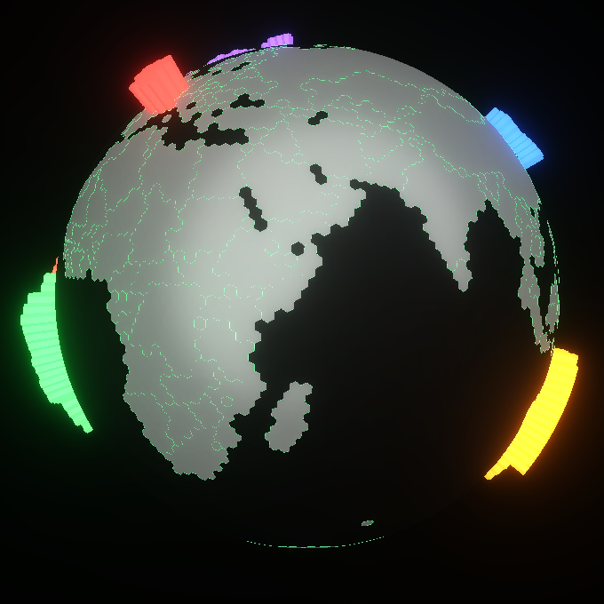

# @aeryflux/globe

Portable 3D globe component for React and React Native (Expo).



**[Live Demo](https://aeryflux.github.io/globe-demo/)**

## Features

- **Cross-platform**: Works on web (React) and mobile (Expo)
- **Three.js powered**: High-quality 3D rendering with WebGL
- **Customizable themes**: Dark, Green, White surfaces
- **Data visualization**: Highlight countries with custom colors
- **WebGL fallback**: Graceful degradation when WebGL unavailable
- **Bundled models**: Pre-generated GLB files with 169 countries (Panama fix included)

## Installation

```bash
npm install @aeryflux/globe three
```

## Usage

### React (Web)

```tsx
import { Globe } from '@aeryflux/globe/react';

function App() {
  return (
    <div style={{ width: '100vw', height: '100vh' }}>
      <Globe
        surface="green"
        showCountries={true}
        rotationSpeed={0.0005}
      />
    </div>
  );
}
```

### React Native (Expo)

```tsx
import { buildGlobeIndex, applyGlobeMaterials } from '@aeryflux/globe/react-native';
import { GLView } from 'expo-gl';
import { Renderer } from 'expo-three';

// See documentation for full Expo implementation
// Reference: Atlas GlobeBackground.tsx
```

## Props

| Prop | Type | Default | Description |
|------|------|---------|-------------|
| `surface` | `'dark' \| 'green' \| 'white'` | `'green'` | Color theme |
| `showCountries` | `boolean` | `false` | Show country fills |
| `showCities` | `boolean` | `false` | Show city markers |
| `rotationSpeed` | `number` | `0.0003` | Globe rotation speed |
| `glowIntensity` | `number` | `0.5` | Border glow intensity |
| `bloomStrength` | `number` | `0.3` | Post-processing bloom |
| `countryData` | `CountryDataMap` | - | Data-driven highlights |
| `modelUrl` | `string` | bundled | Custom GLB model URL |

## Bundled Models

| Model | Size | Use Case |
|-------|------|----------|
| `atlas_hex_subdiv_5.glb` | 2MB | Mobile (default) |
| `atlas_hex_subdiv_6.glb` | 5.7MB | Desktop |
| `weather_hex_globe_subdiv_3.glb` | 212KB | Weather overlay |

All models include the Panama fix (169 countries with `min_pass2_votes=1`).

## Data Visualization

```tsx
import { Globe } from '@aeryflux/globe/react';

const countryData = {
  France: { scale: 0.8, color: '#ef4444' },
  Japan: { scale: 0.6, color: '#3b82f6' },
  Brazil: { scale: 1.0, color: '#22c55e' },
};

<Globe
  surface="dark"
  showCountries
  countryData={countryData}
  dataHighlightColor="#00ff88"
/>
```

## Surfaces

| Surface | Accent | Background | Countries |
|---------|--------|------------|-----------|
| `dark` | White | #050508 | Light gray |
| `green` | #00ff88 | #050508 | Light gray |
| `white` | Black | #ffffff | Light gray |

## License

MIT - Created by [AeryFlux](https://github.com/aeryflux)

## Credits

- [Three.js](https://threejs.org/) - 3D rendering
- [geojsonto3D](https://github.com/martinbaud/geojsonto3D) - Globe model generation
- [Natural Earth](https://www.naturalearthdata.com/) - Geographic data
